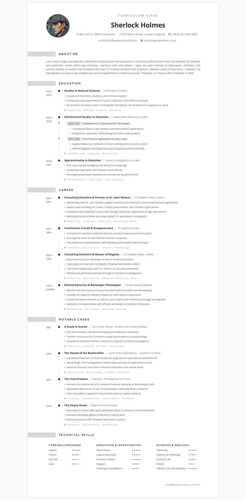

# 📄 CVSmith

A modern Python library to convert YAML-formatted CV data to professional, clickable PDF documents using Jinja2 templates and Playwright.

## 👀 Preview

Here's what a CVSmith-generated CV looks like:



## ✨ Features

- ✨ **Automatic Link Detection** - Email addresses, phone numbers, and URLs are automatically converted to clickable links in PDFs and HTML
- **Template-Based** - Highly customizable Jinja2 templates for professional CV design
- **Paper Size Control** - Generate A4 or US Letter format PDFs from the same data
- **Professional Output** - Clean, responsive HTML and PDF rendering using modern CSS
- **YAML-Powered** - Simple YAML format for CV content, easy to maintain and version control

## 📦 Installation

```powershell
uv sync
```

This creates a virtual environment in `.venv/` and installs all dependencies. All commands should be run with `uv run` to use this environment.

## 🚀 Quick Start

### Command-Line Options

```powershell
--yaml PATH            # Path to YAML file with CV data (required)
--template NAME        # Template filename in templates/ directory (required, default 'modern.jinja2')
--output PATH          # Output folder path - generates cv.pdf and cv.html (required)
--paper-size SIZE      # Paper size: 'a4' (default) or 'letter'
```

### Example

```powershell
uv run cvsmith --yaml "examples/sherlock.yaml" --template "modern.jinja2" --output "output_folder" --paper-size "a4"
```

This generates:

- `output_folder/cv.pdf` - The rendered PDF document
- `output_folder/cv.html` - The rendered HTML document

## ✍️ Creating Your CV

### Basic YAML Format

See [Sherlock Holmes example](examples/sherlock.yaml) for a complete example. Only use the elements you need!

## 🎯 Features in Detail

### 🔗 Automatic Link Detection

The template automatically detects and creates clickable links for:

- **Emails**: `sherlock@bakerstreet.london` → `mailto:` link
- **Phone Numbers**: `+44 (0) 20 7946 0958` → `tel:` link
- **Websites**: `consulting-detective.co.uk` → `https://` link

Just add them to your `personal_info` section and they'll be clickable in PDFs!

### 📏 Paper Size Support

CVSmith generates PDFs optimized for:

- **A4** (default): 210mm × 297mm - Standard international format
- **Letter**: 216mm × 279mm - Standard US/Canada format

Use `--paper-size letter` to switch formats without changing your CV data.

### 🎨 Customizable Templates

Templates use Jinja2 syntax and have access to all your YAML data. You can customize colors, fonts, and layout by modifying the CSS variables in [templates/modern.jinja2](templates/modern.jinja2) and by building your own template.

### 🔍 Examples

See [examples/](examples/) for working examples including the Sherlock Holmes CV.
